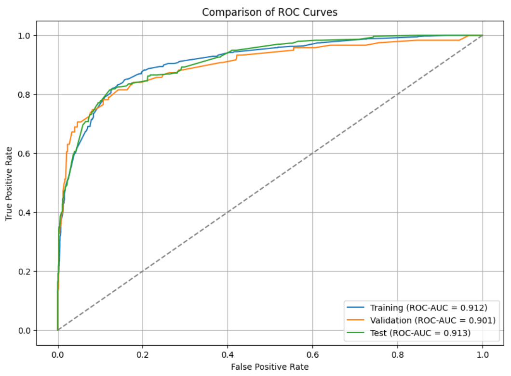

# Credit Risk Analysis - HMEQ Dataset

## Overview

This project analyses the credit risk of a portfolio using data from the HMEQ dataset. The analysis is divided into three sections:

1. **Preprocessing and EDA**: Initial splitting, cleaning and exploration of the dataset; feature de-selection to remove the least useful features.
2. **Modelling and analysis**: Transformation, multiple feature selection and probability of default (PD) modelling of datasets using logistic regression.
3. **Risk-Weighted Asset (RWA) Calculations**: Application of PD model developed in the previous section to calculate capital requirements using the Foundation Internal Ratings-Based (F-IRB) approach; results compared with the Standardised approach (SA).

Each section can be found in the 'notebooks' folder.

For more information about the dataset: http://www.creditriskanalytics.net/datasets-private2.html

## Calculating capital requirements

### Standardised approach (SA)
The standardised approach to credit risk is one approach used to calculate a bank's capital requirements in accordance with Basel III banking regulations (BIS, 2024). The approach uses standardised risk weights to calculate risk-weighted assets (RWA), which is calculated using the following formula:

$$
\text{RWA} = \sum (\text{risk weight} \times \text{exposure amount})
$$

An overview of the standardised approach to residential retail exposures can be found in the table below (based on BIS, 2017).

|   | Loan-to-value (LTV) Band        | Below 50% | 50% to 60% | 60% to 70% | 70% to 80% | 80% to 90% | 90% to 100% | Above 100% | Criteria Not Met |
|---|---------------|------------|------------|------------|------------|------------|------------|------------|-----------------|
|   | **Risk Weight (%)** | 20         | 25         | 30         | 30         | 40         | 50         | 70         | RW of counterparty |

The dataset has the following distribution of LTV ratios:

For reference, I have included the percentage of defaults for each LTV band.

According to the Basel III frameworkc (BIS, 2020b), banks must meet the following requirements:

1) Common Equity Tier 1 >= 4.5% of RWA.
2) Tier 1 capital >= 6% of RWA.
3) Total capital >= 8% of RWA.

Using the standardised approach, I calculate the total risk-weighted assets (RWA) as the sum of RWA for all borrowers, and assume the exposure to be the sum of outstanding mortgage values.

### F-IRB approach

The internal ratings-based approach is the second method used to calculate a bank's capital requirements in accordance with Basel III banking regulations (BIS, 2024). This approach allows banks to use internal ratings systems to determine the capital requirements for a given exposure. The risk components include measures of the probability of default (PD), loss given default (LGD), and exposure at default (EAD).

To calculate risk weights for residential mortgages, the following formula is used (BIS, 2020a):

This is applied to exposures that are **not in default** and are secured (or partly secured) by residential mortgages.

I assume a LGD of 0.45 for each borrower based on the example from BIS (2017). I use the PD for each borrower as calculated in the PD model.

## Results

### Performance of the PD model on the test set

The ROC-AUC score on the test set is **0.91**, demonstrating excellent discriminatory power. This performance aligns closely with the scores observed on the training set (**0.91**) and validation set (**0.90**). The model performed consistently well across training, validation, and test datasets, making it a strong predictor of credit behaviour and well-suited for applying probability of default (PD) estimates to the F-IRB approach.

To check whether my model functions correctly, I run an analysis to check for monotonicity. Each borrower is assigned a group between 1 and 10 (group 1 = the lowest probability of default), and each group is defined either using a cut-off (those with a probability of default between 0 and 0.1 are in group 1, above 0.1 up to 0.2 in group 2, and so on) or a quantile (those up to the 10th percentile are in group 1, and so on).

A well-functioning model should see an increasing number of defaults as the group number increases (a monotonic result), and the default rate within each group should closely match the predicted probability of default. The training data appears to be monotonic, but the validation and test data showing fluctuating default rates between groups 5 and 7. This is unfortunate, but does not invalidate the model. However, it will be addressed in future modifications to the model.

The predicted probabilities of default are fed into the F-IRB model:

### Capital requirements of the portfolio under the Standardised and IRB

Risk-weighted assets and capital requirements are much lower under the standardised approach (SA) than the internal ratings-based approach (F-IRB). This is to be expected because the SA uses only the LTV ratio as a proxy for risk, and the average LTV ratio of around 0.7 seems neither high nor low for a bank offering residential mortgages.

On the other hand, the F-IRB approach is strongly impacted by the estimated probability of default (PD), which in this portfolio is around 20%. This seems to be a very high probability--one in five borrowers--and has a large impact on k (capital requirement), which in turn has a large impact on risk-weighted assets. Had the average PD been closer to around 1%, the total RWA for the F-IRB approach would have been quite similar to the SA. Similarly, had the LGD been calculated using a recovery rate, rather than using the recommended 0.45, this RWA may have been reduced further. 

| Metric                                      | F-IRB           | SA              |
|---------------------------------------------|-----------------|-----------------|
| **Total Risk-Weighted Assets (RWA)**        | 474,727,437.71  | 136,559,070.63  |
| **Total Exposure at Default (EAD)**         | 420,538,686.01  | 420,538,686.01  |
| **Average Risk Weight**                     | 1.13            | 0.32            |
| **CET1 Requirement (4.5% of RWA)**          | 21,362,734.70   | 6,145,158.18    |
| **Tier 1 Requirement (6% of RWA)**          | 28,483,646.26   | 8,193,544.24    |
| **Total Capital Requirement (8% of RWA)**   | 37,978,195.02   | 10,924,725.65   |
| **Total Capital Requirement as % of EAD**   | 9.03            | 2.60            |

## References

BIS, 2017. High-level summary of Basel III reforms. Available at: https://www.bis.org/bcbs/publ/d424_hlsummary.pdf (Accessed 23 January 2025)

BIS, 2020a. Calculation of RWA for credit risk: IRB approach: risk weight functions. Available at: https://www.bis.org/basel_framework/chapter/CRE/31.htm (Accessed 25 January 2025)

BIS, 2020b. Risk-based capital requirements: Calculation of minimum risk-based capital requirements. Available at: https://www.bis.org/basel_framework/chapter/RBC/20.htm (Accessed 23 January 2025)

BIS, 2024. Calculation of RWA for credit risk: Standardised approach: individual exposures. Available at: https://www.bis.org/basel_framework/chapter/CRE/20.htm (Accessed 23 January 2025)
